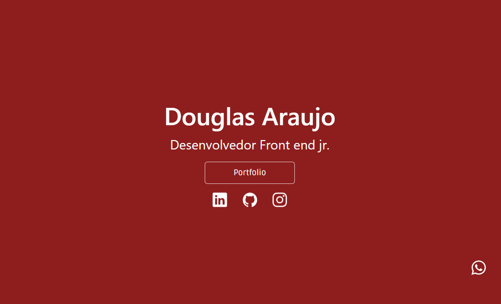
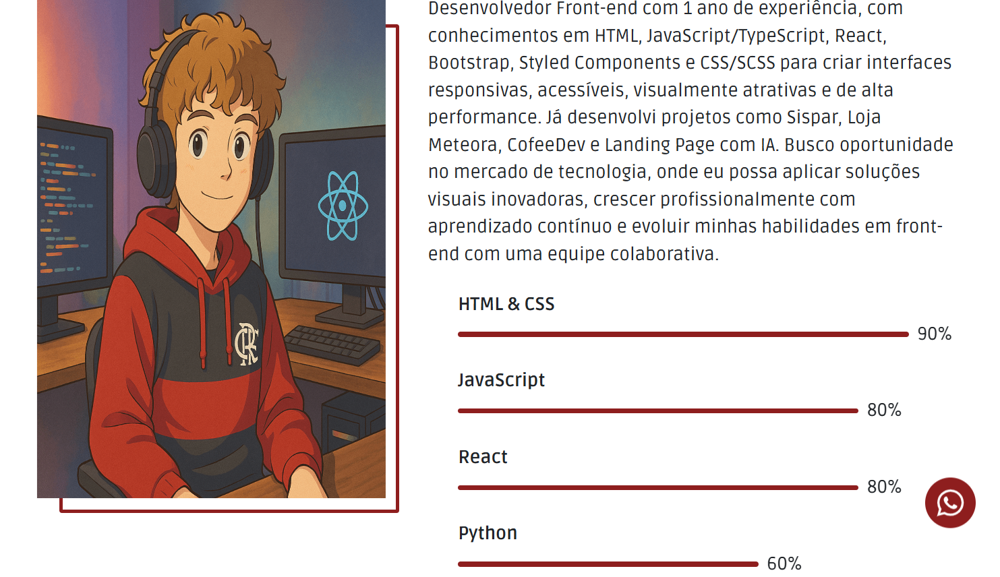
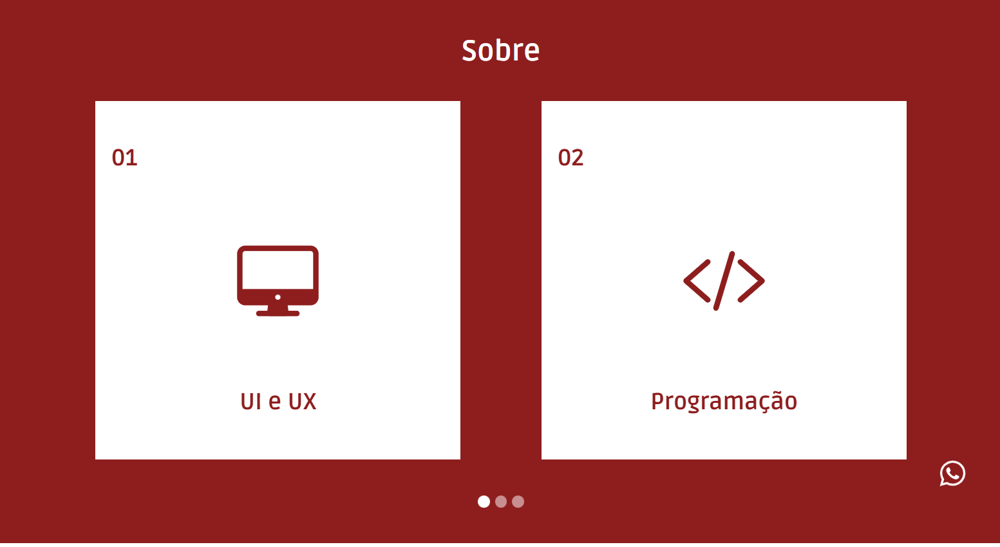
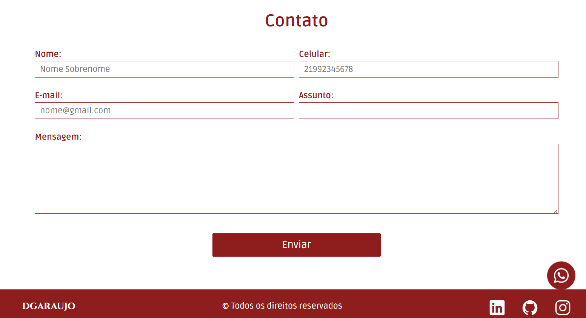

#Portifolio base
  

# 📁 Portfólio Básico

Este projeto é um portfólio pessoal simples desenvolvido com **HTML**, **Sass** e **JavaScript**, com o objetivo de demonstrar conhecimentos básicos em desenvolvimento front-end e para ajudar que quer um portifolio basico.

## 🚀 Tecnologias Utilizadas

- **HTML5** — estrutura da página
- **Sass (SCSS)** — estilização moderna e modular
- **JavaScript** — interações básicas
- **Bootstrap** — framework CSS para carousel

## 🎯 Objetivo

Criar uma página responsiva que possa servir como ponto de partida para projetos maiores e mostrar habilidades essenciais no desenvolvimento web.

## 📷 Prévia

Você pode visualizar o projeto rodando localmente abrindo o arquivo `index.html` em seu navegador.

## 📁 Estrutura do Projeto

Portifolio-1/ 
├── assets/
│   ├── img/
│   │   ├── home.png 
│   │   ├── sobre.png 
│   │   ├── servicos.png 
│   │   ├── contato.png 
│   |── css/
│   |   ├── style.css 
│   |   └── style.css.map
│   └── sass/
│       ├── _config.scss
│       └── _utils.scss
├── index.html 
├── style.scss 
├── script.js 
└── package.json

## 📌 Como executar

1. Clone o repositório:

https://github.com/dgarauj04/Portifolio-1.git

2. Instale um compilador Sass (ex: `sass` via npm) para gerar o CSS:
 
 npm run sass

 ou
 
Utilize a extensão live sass

3. Abra `index.html` no navegador.

## 📬 Contato

Se quiser trocar uma ideia ou sugerir melhorias:

- Email: [douglasdab10@gmail.com]
- GitHub: [@dgarauj04](https://github.com/dgarauj04)
- Linkedin: [https://www.linkedin.com/in/douglas-araujo-dgprogdev/]
- Instagram: [@dgaraujoo_](https://www.instagram.com/dgaraujoo_)

---

Este projeto é apenas um ponto de partida — fique à vontade para aprimorá-lo e deixá-lo com sua cara. Se quiser, posso te ajudar a deixá-lo ainda mais interativo ou responsivo!
